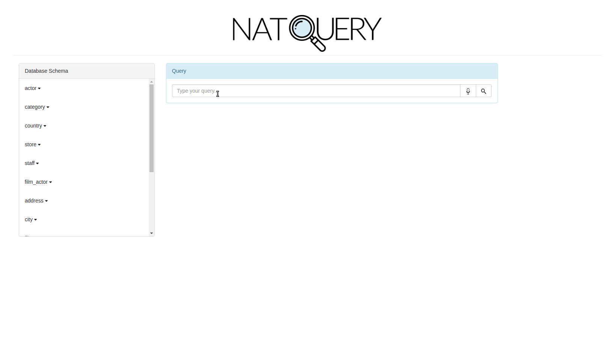

--------------------------------------------------------------------------------
An application that acts as a natural language interface and visualization tool for databases. Built for the Power Of Connected Hackathon by Honeywell.

## Setup

Download the [ pagila sql dump](https://github.com/devrimgunduz/pagila). Make sure flask,sqlalchemy,psycopg2 are installed. Install Postgres (9.6). 

Enter postgres command line.  

`sudo -u postgres psql`

Create a user.

`CREATE USER darkstar WITH PASSWORD 'password';`

Create the database.

`CREATE DATABASE pagila;`

Connect to the database.

`\c pagila`

Import the pagila sql dump.

`\i 'path/to/pagila-data.sql'`

Grant connect, create, temp rights to user.

`GRANT ALL PRIVILGES ON DATABASE pagila TO darkstar;`

Grant table access to user.

`GRANT ALL PRIVILEGES ON ALL TABLES IN SCHEMA public TO darkstar;`

Useful psql cli commands

- \q: Quit.
- \c __database__: Connect to a database.
- \d __table__: Show table definition including triggers.
- \l: List databases.
- \du: List users.
- \du __username__: List a username if present.
- \dt : List all tables in current schema.

Libraries used for NLP - nltk, spacy.

## Demo

The following demonstrates the basic usage of the app.

